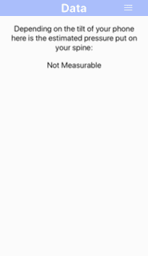

# _Spineful_

##### _Capstone Project for Epicodus_

#### By _**Veronica Stanley-Katz**_

## Description

_This application was designed to show users the damage they're doing to their spines based on the angle of their phone. This application uses the assumption that people will hold their phone at a steeper angle when slouching. The data is based on the research of Dr Kenneth K. Hansraj for the Assessment of Streeses in the Cervical Spine Caused by Posture and Position of the Head._

## Specs

    
  Loading & Home Screen   |   Drawer Navigation & Stretches    |  Sources | Data of Pressure on Neck

<!-- |Specs|Input|Output|
|-|-|-|
|The program should allow a user to view the estimated weight pressured on their spine given specific phone angles.| Accelerometer Z < -.27, y < 0 | 27 lbs |
|The program should allow a user to access stretch information.| Navi: Stretches |List of Stretches| -->

## Setup-Installation Requirements

### To Run Locally

- _Go to https://github.com/vstankatz/Spineful_
- _Clone the GitHub repository._
- _Install expo-cli onto your system if you don't have it(https://docs.expo.io/versions/v36.0.0/get-started/installation/)_
- _In your terminal/command line go into the folder that was cloned and run "npm install"._
- _Once npm install is done downloading all the package dependencies run "expo start" to start the server._
- _Once the server visual loads in your browser:_
  - _To run on a simulation chose one of the options on the left side-bar_
  - _To run on a phone download the Expo App from the Android or Apple App Store, then view the provided QR code in your phone camera and click "open in expo" when prompted._
- _This first view will show you the home page, from there use the side-bar/drawer or buttons to navigate around the site._
- _To view the spine pressure info go to the "Data" tab on the side bar or click "Check Your Spine Pressure" on the home screen. Once there move your phone at various angles and see your results._

## Known Bugs

Data screen fails to unmount accelerometer when user leaves page. Flatlist on stretch page throws errors due to lack of key.

## Technologies Used

- _React Native_
- _Expo-cli_
- _JavaScript_
- _Markup_
- _HTML_

### License

Copyright (c) 2019 **_Veronica Stanley-Katz_**

MIT License

Permission is hereby granted, free of charge, to any person obtaining a copy
of this software and associated documentation files (the "Software"), to deal
in the Software without restriction, including without limitation the rights
to use, copy, modify, merge, publish, distribute, sublicense, and/or sell
copies of the Software, and to permit persons to whom the Software is
furnished to do so, subject to the following conditions:

The above copyright notice and this permission notice shall be included in all
copies or substantial portions of the Software.

THE SOFTWARE IS PROVIDED "AS IS", WITHOUT WARRANTY OF ANY KIND, EXPRESS OR
IMPLIED, INCLUDING BUT NOT LIMITED TO THE WARRANTIES OF MERCHANTABILITY,
FITNESS FOR A PARTICULAR PURPOSE AND NONINFRINGEMENT. IN NO EVENT SHALL THE
AUTHORS OR COPYRIGHT HOLDERS BE LIABLE FOR ANY CLAIM, DAMAGES OR OTHER
LIABILITY, WHETHER IN AN ACTION OF CONTRACT, TORT OR OTHERWISE, ARISING FROM,
OUT OF OR IN CONNECTION WITH THE SOFTWARE OR THE USE OR OTHER DEALINGS IN THE
SOFTWARE.
